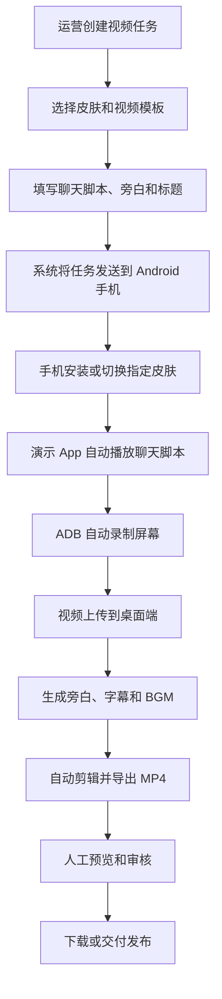
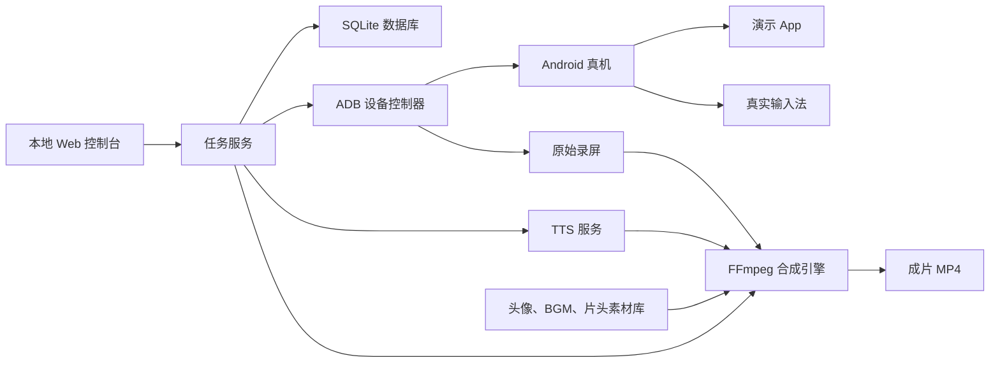

# 输入法皮肤展示视频自动化系统项目计划书

## 1. 项目概述

### 1.1 项目名称

输入法皮肤展示视频自动化系统

### 1.2 建设目标

开发一套内部使用的工具，通过 Android 演示 App、真实输入法皮肤、真机录屏和桌面端自动合成，实现输入法皮肤展示视频的批量生产。

运营人员只需选择皮肤、填写或生成文案，即可输出 1 到 2 分钟的成片。视频包含：

- 聊天消息发送过程
- 真实输入法皮肤和按键反馈
- 候选栏、动效等展示
- 片头和片尾
- 旁白
- 字幕
- BGM
- 品牌文案

### 1.3 核心原则

- 使用内部演示 App，不自动操作真实微信。
- 使用真实 Android 输入法，不模拟键盘画面。
- 录制与剪辑模板化，减少人工操作。
- 成片发布前保留人工审核环节。
- 优先支持 USB 连接的实体手机，保证画面稳定。

## 2. 使用流程



运营人员无需手动打开聊天软件、逐句输入消息或使用剪映剪辑。

## 3. 产品组成

### 3.1 Android 演示 App

#### 用途

提供类似即时聊天工具的展示界面，触发真实输入法，并根据脚本自动完成录制过程。

#### MVP 功能

- 单聊界面
- 自定义联系人昵称、头像和聊天背景
- 自定义左右两侧消息气泡
- 清空聊天记录
- 自动聚焦输入框并弹出真实输入法
- 根据脚本逐条输入和发送消息
- 支持文字输入、删除、停顿和滚动
- 展示皮肤按键反馈和候选栏
- 接收桌面端任务
- 上报执行状态
- 失败后重新执行

#### 脚本示例

```json
{
  "scenarioId": "summer_001",
  "contact": {
    "name": "小夏",
    "avatar": "avatar_03.png"
  },
  "actions": [
    {
      "type": "input",
      "text": "今天换了一个新的输入法皮肤",
      "speed": 160
    },
    {
      "type": "wait",
      "duration": 1200
    },
    {
      "type": "send"
    },
    {
      "type": "input",
      "text": "打字的时候还有动态效果",
      "speed": 140
    },
    {
      "type": "send"
    }
  ]
}
```

#### 注意事项

若输入法支持内部调试接口，应优先使用调试接口切换皮肤。否则第一版可以由运营人员在录制前手动切换皮肤。

### 3.2 Windows 任务控制台

#### 用途

作为运营人员的主要操作界面，负责创建任务、控制手机录屏、触发剪辑和查看结果。

#### MVP 功能

- 连接 Android 手机
- 检查 ADB 状态
- 检查演示 App 是否在线
- 创建视频任务
- 选择皮肤编号
- 编辑聊天脚本
- 选择视频模板
- 配置 BGM、旁白和字幕样式
- 一键开始录制
- 获取录屏文件
- 自动生成成片
- 播放预览
- 导出 MP4
- 保存历史任务

#### 推荐形式

第一版建议开发 Windows 桌面端或本地 Web 控制台：

| 方案 | 优点 | 适用阶段 |
| --- | --- | --- |
| 本地 Web 控制台 | 开发快，便于迭代 | MVP 推荐 |
| Windows 桌面端 | 更适合非技术运营人员 | 第二阶段 |
| 云端管理平台 | 可管理多台设备和多人协作 | 批量生产阶段 |

### 3.3 录屏控制模块

#### 工作方式

桌面端通过 USB 调用 Android 官方 ADB 工具：

```bash
adb shell screenrecord /sdcard/showcase.mp4
adb pull /sdcard/showcase.mp4
```

#### MVP 能力

- 开始和停止录屏
- 自动拉取视频
- 检查视频是否有效
- 记录录屏时长和分辨率
- 统一手机屏幕方向
- 录屏失败后自动重试

#### 设备建议

- 固定使用 1 到 3 台 Android 测试机
- 分辨率统一，例如 `1080 x 2400`
- 关闭通知弹窗、自动更新和来电提醒
- 开启开发者选项和 USB 调试
- 保持充电并设置常亮
- 建立固定的演示账号和素材库

### 3.4 自动剪辑模块

#### 推荐技术

第一版使用 FFmpeg。后续如需更复杂的动态视觉模板，可增加 Remotion。

#### 自动化内容

- 裁剪录屏开头和结尾
- 插入片头、片尾
- 添加皮肤名称和卖点
- 添加旁白
- 根据旁白生成字幕
- 添加 BGM
- 控制 BGM 音量
- 旁白期间自动降低 BGM 音量
- 添加局部放大或重点提示
- 输出标准 MP4 文件

#### 视频模板

建议 MVP 内置 3 套模板：

| 模板 | 时长 | 场景 |
| --- | --- | --- |
| 快速展示 | 45 到 60 秒 | 短视频快速预览 |
| 完整体验 | 60 到 90 秒 | 展示打字、候选栏和动效 |
| 氛围展示 | 60 到 120 秒 | BGM、旁白和情绪化文案 |

### 3.5 旁白、字幕和文案模块

#### MVP 方案

- 运营人员填写旁白文本
- 系统调用 TTS 服务生成音频
- 根据旁白文本生成字幕时间轴
- FFmpeg 将字幕嵌入视频

#### 可选增强

- AI 根据皮肤名称、主题、颜色和卖点生成聊天文案
- AI 生成三种旁白风格：清新、活泼、测评
- 建立敏感词检查
- 建立品牌语气模板
- 自动生成视频标题和发布文案

## 4. 系统架构



### 推荐技术栈

| 模块 | 推荐技术 |
| --- | --- |
| Android App | Kotlin、Jetpack Compose 或 XML Layout |
| Android 自动控制 | ADB、自定义脚本执行器、必要时使用 UI Automator |
| 本地 Web 控制台 | React + TypeScript |
| 本地后端 | Node.js 或 Python FastAPI |
| 数据存储 | SQLite |
| 视频合成 | FFmpeg |
| 动态视频模板 | Remotion，作为第二阶段增强 |
| 旁白生成 | 可替换的云端 TTS 接口 |
| 文件存储 | 本地目录，后期可迁移对象存储 |

## 5. 里程碑规划

### 第一阶段：需求验证与技术预研

预计 1 周。

#### 目标

验证真实输入法是否可以稳定展示和录制。

#### 工作内容

- 确定测试手机型号和 Android 版本
- 验证输入法皮肤安装与切换方式
- 验证 ADB 录屏质量
- 开发最简聊天页面
- 测试自动输入、发送和停顿
- 验证录屏文件可被 FFmpeg 正常处理

#### 交付物

- 技术验证报告
- 30 秒演示视频
- 风险清单

### 第二阶段：MVP 开发

预计 3 到 4 周。

#### Android 端

- 聊天展示页面
- 脚本解析器
- 输入与发送动作
- 头像、昵称和背景配置
- 任务执行状态上报
- 异常重试

#### 桌面端

- 设备检测
- 视频任务表单
- 脚本编辑
- 录屏控制
- 文件拉取
- 历史记录
- 视频预览

#### 视频处理

- 3 套基础模板
- 旁白合成
- 字幕嵌入
- BGM 混音
- MP4 导出

#### 交付物

- 可运行的 MVP
- 安装文档
- 操作手册
- 10 条不同皮肤的测试视频

### 第三阶段：运营增强

预计 2 到 3 周。

#### 工作内容

- 素材库管理
- 皮肤信息管理
- AI 聊天脚本生成
- AI 旁白生成
- 批量任务
- 失败任务重跑
- 多模板管理
- 字幕样式编辑
- 导出记录和审核状态

#### 交付物

- 可供运营日常使用的版本
- 批量生成能力
- 视频模板配置文档

### 第四阶段：规模化生产

按业务量决定是否实施。

#### 工作内容

- 多台手机并行录制
- 任务队列
- 设备在线状态监控
- 云端后台
- 账号与权限
- 自动质检
- 素材版本管理
- 发布平台接口对接

## 6. 验收标准

### MVP 功能验收

- 能识别 USB 连接的 Android 手机。
- 能自动启动演示 App。
- 能加载一份聊天脚本。
- 能展示真实输入法皮肤。
- 能自动输入并发送至少 5 条消息。
- 能录制并拉取完整视频。
- 能自动添加旁白、字幕和 BGM。
- 能导出 `1080p` MP4。
- 同一任务连续执行 10 次，至少 9 次成功。
- 单条视频从创建任务到生成成片不超过 10 分钟。

### 画面验收

- 不出现真实微信品牌标识。
- 不出现系统通知和无关弹窗。
- 输入法皮肤清晰可见。
- 字幕不遮挡输入法核心区域。
- BGM 不影响旁白辨识。
- 片头和片尾符合品牌规范。

## 7. 主要风险

| 风险 | 影响 | 应对方案 |
| --- | --- | --- |
| 输入法无法自动切换皮肤 | 每条视频仍需人工准备 | 增加内部调试接口或二维码安装入口 |
| 自动输入无法呈现逐键点击效果 | 皮肤动效展示不足 | 在演示 App 或输入法测试版中增加逐键回放能力 |
| 不同手机分辨率导致布局变化 | 视频模板不稳定 | 首期固定手机型号和分辨率 |
| ADB 偶发断连 | 录制任务失败 | 增加设备健康检查和自动重试 |
| 云端 TTS 风格不统一 | 视频品质不稳定 | 固定音色、语速和品牌词典 |
| 全自动成片缺少人工判断 | 可能出现不自然内容 | 发布前保留审核状态 |
| BGM 授权不清晰 | 商业发布风险 | 使用自有或明确授权的音乐素材库 |

## 8. 人员与周期估算

### MVP 最小团队

| 角色 | 投入 |
| --- | --- |
| Android 工程师 | 1 人 |
| 前端或全栈工程师 | 1 人 |
| 视频模板与运营 | 0.5 人 |
| 测试 | 0.5 人 |

### 时间估算

- 技术预研：1 周
- MVP：3 到 4 周
- 运营增强：2 到 3 周
- 首个可日常使用版本：约 6 到 8 周

## 9. 推荐实施顺序

第一版不要立刻做 AI 文案、多设备调度和自动发布。应优先完成：

1. 固定一台测试手机。
2. 开发最简 Android 演示 App。
3. 跑通脚本输入、真机录屏和视频拉取。
4. 用 FFmpeg 完成一套自动剪辑模板。
5. 连续生成 10 条不同皮肤的视频。
6. 根据运营反馈再增加素材库、AI 文案和批量任务。

最关键的技术验证点是：真实输入法是否允许稳定地逐键回放，并完整展示皮肤动效。这个结论会决定后续自动化程度。
